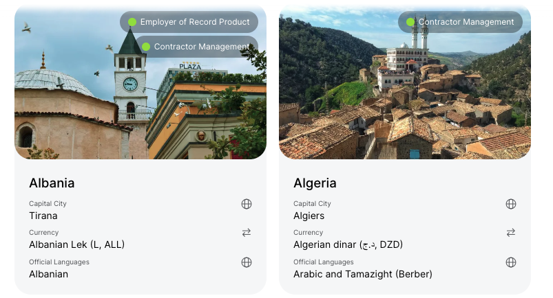

# V2 Improvements, Bugs & Design Brief

## General/ multi-page issues

- Dark mode broken. Remove entirely
- Rebrand NomadTaxPro to Wealthy Wanderers based off materials
- Top right navigation needs to be more visible. Username should not be larger than the nav links
- Default profile picture added automatically 

## Country Search Page 

(currently https://www.wealthy-wanderers.com/dashboard)

### Changes/ Improvements

- Change endpoint to /country-database
- Search fields (*any not included in this list shall be removed*)
    1) Free Text search for country_name (good as is) 
    2) Display: "Best for". Querying: best_for field of list values in country document. Type: multiselect. Should show all the Dropdown for all present values in country documents(retirees, nomads, etc). These fields should be updated dynamically in the multiselect filter.
    3) Display: "Cost of Living." Querying: cost_of_living_icon_lvl. Type: Multiselect for $, $$, $$$ and $$$$. 
    4) Display: "Region". Querying: "region". Type: multiselect. Should show all the Dropdown for all present values in country documents
    5) Display: "Had Nomad Visa". Querying "has_nomad_visa." Type: Checkbox based off of boolean
- Only display countries that have `display: true` field/value pair
- Change to cards with additional information below. [Relevant example](https://remote.com/country-explorer?service=all). 
    . Card design should follow this pretty closely with the exception of the text. Visible fields should be country name as in the example, "cost of living" in $, $$, $$$ or $$$$ (pulled from `cost_of_living_icon_lvl`), Currency, and Current Time. As in the example above, there are green lights with text to the left for "Contractor Management." If `has_specicial_tax_regime" is true for country document, this text should say "Special Tax Regime" 
- Align left/ do not center when view pane cannot be filled (4 countries wide row on my Macbook)

## Country Page
(currenlty https://www.wealthy-wanderers.com/dashboard/country_detail/n)
Generally speaking, we are using [this website](https://remote.com/country-explorer/france) as inspiration for the country database.

### Changes/ Improvements

- Change route to www.wealthy-wanderers.com/country-database/{country_name}
- Redesign

### Known Bugs

- Adding favorite is not responsive. Remove status bar with simple alert that matches website UI. A simple "Added {country_name} to favorites" will suffice. 

## Tracker Page

*need more info on tracker page to explain what is going on and why it is important.*
### Changes/ Improvements

- *need more info on tracker page to explain what is going on and why it is important.*
- Change route to /tracker
- Status bar is lagging and ugly when removing a favorite. Use new dialogue box.
- "add stay" form on left side above favorites. 

- Alerts at top of the page. Sorted by those most pertinent based off of current stay and those coming up

## Design Work for Dev

- Country search page above search bar. Pretty plain right now. Should inspire sense of adventure balanced with the theme of the website -- finances
- Replace favi and images with Wealthy Wanderers stuff/ remove NomadTaxPro

## Design work for Jeff

- default user icon before adding picture
- Name plate for top left

## Major Projects

- Landing Page
- User info collection/ survey

## Login/ Signup

- Add Google Oauth
- Login link for existing users from landing page